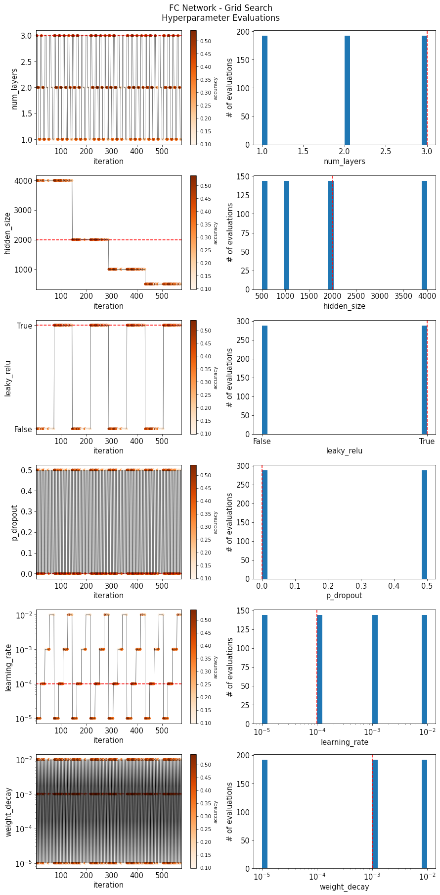
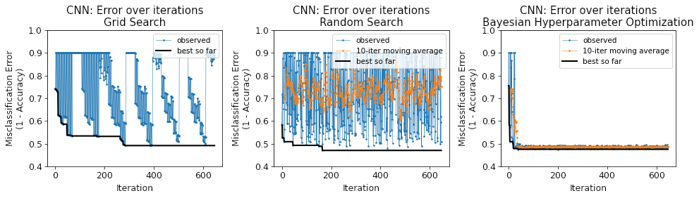
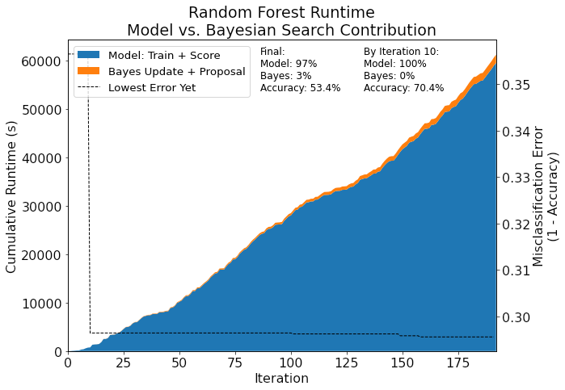
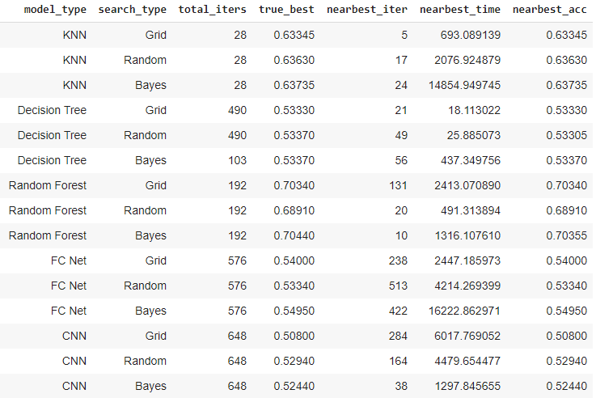
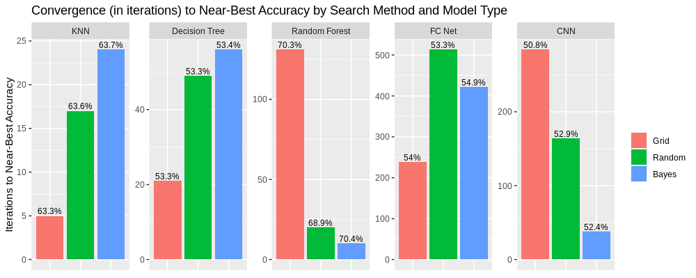

# Hyperparameter Search

This code grew out of my final project for a neural networks course at the University of Massachusetts, Amherst. The goal of the project was to evaluate the effectiveness of Bayesian hyperparameter optimization in finding the optimal (or "good enough") hyperparameters for models of varying complexity, and to compare this approach with grid search and random search. The model types evaluated were K-Nearest Neighbors (KNN; the simplest), decision trees, random forests, fully connected neural networks, and convolutional neural networks (CNNs; the most complex). "Complexity" here is a rough sense of the capacity of a given machine learning model, and in this project it can be very roughly considered in relation to the number of hyperparameters used by the model; more hyperparameters correspond to a more complex model.

The benefit of Bayesian hyperparameter optimization (at times called "Bayesian search" and "Bayes search", here; it is sometimes also called "Sequential Model-Based Optimization" (SMBO) in the literature) is that it incorporates the information gained from evaluating the performance of previous settings of hyperparameters. By contrast, grid search and random search conduct their searches using a pre-set schedule or without any guidance at all, respectively. This makes Bayesian hyperparameter optimization an attractive choice for understanding the hyperparameter space when there are many hyperparameters to optimize. This project used a relatively simple form of Bayesian hyperparameter optimization that uses Gaussian processes as the surrogate model and expected improvement (EI) as the acquisition function. There are more complicated and more efficient surrogate models including decision trees, random forests, and Tree of Parzen Estimators (TPE) that can outperform Gaussian processes, especially in higher dimensions (of hyperparameters), but Gaussian processes are by far the most common. One downside to Gaussian processes is that the fitting step (where the surrogate function is fit to the hyperparameter evaluations of the "objective function", i.e., the model being trained) scales cubically with the number of data points (hyperparameter evaluations).

I used [scikit-optimize's](https://scikit-optimize.github.io/stable/) implementation of Bayesian hyperparameter optimization to conduct our experiment. The [`1D Toy Model.ipynb`](1D Toy Model.ipynb) notebook explores the details of how this package works by using the underlying [`gp_minimize`](https://scikit-optimize.github.io/stable/modules/generated/skopt.gp_minimize.html) function to optimize a known objective function. The other notebooks, named after the model types (e.g., [`KNN.ipynb`](KNN.ipynb)), use the [`BayesSearchCV`](https://scikit-optimize.github.io/stable/modules/generated/skopt.BayesSearchCV.html#skopt.BayesSearchCV) object to abstract away the implementation details. 

The notebooks in this project named after the five model types ([`KNN.ipynb`](KNN.ipynb), [`DecisionTree.ipynb`](DecisionTree.ipynb), [`RandomForest.ipynb`](RandomForest.ipynb), [`FCNet.ipynb`](FCNet.ipynb), and [`RandomForest.ipynb`](RandomForest.ipynb)) show the process of setting up, training, evaluating, and visualizing the three search algorithms on each model type. The [`Plots.ipynb`](Plots.ipynb) notebook combines plots for all search algorithms and model types into a single notebook.

The final PDF of my report is not provided here, but is available upon request. The primary purpose of providing the code in this repository is to serve as an example of:

1. How to use Bayesian hyperparameter optimization (via the scikit-optimize package).
1. How to conduct grid search, random search, and Bayesian search on neural networks implemented in PyTorch.
1. How to visualize the search through the hyperparameter space.
1. How to visualize and compare model convergence for each of the search algorithms.
1. How to evaluate the contribution of the overhead of Bayesian hyperparameter optimization to the total runtime (including training and validation).

Since the final project was submitted, the code has been cleaned up and some issues were fixed (perhaps most importantly, adding reproducibility when run on GPUs via a couple settings on CUDA that I wasn't aware of at the time). In addition, for the project report, when it came to the neural networks, I did not use the 10,000 validation set examples from CIFAR-10, opting instead to divide the 50,000 training examples into 49,000 examples for training and 1,000 examples for validation. When cleaning up the code for this repository and re-running things, I decided to use all 50,000 training examples for training, and the 10,000 validation set examples given by CIFAR-10 for validation/testing. This affected the final accuracies and runtime. The results for the KNN, decision tree, and random forests are approximately the same, however. As a result of the above, the results of the report are different than the results shown in the notebooks in this repository or in the figures shown in the [`results`](https://github.com/willjobs/hyperparameter-search/tree/main/results) folder.

# Figures

There are many figures in the [`results`](https://github.com/willjobs/hyperparameter-search/tree/main/results) folder, but some representative examples are given below.

<figure>
    
    <figcaption>Hyperparameters evaluated during grid search on the fully connected neural networks</figcaption>
</figure>

<figure>
    
    <figcaption>Convergence of each search algorithm on CNNs to the optimal hyperparameters, as evaluated by accuracy and cumulative best accuracy.</figcaption>
</figure>

<figure>
    
    <figcaption>Total runtime of Bayesian hyperparameter optimization on random forests, including a breakdown by fit + training time and the overhead of Bayesian search.</figcaption>
</figure>

<figure>
    
    <figcaption>Summary of accuracy, runtime, and convergence for each model type and search algorithm.</figcaption>
</figure>

<figure>
    
    <figcaption>Effect of model complexity on the performance of each search algorithm to converge to the optimal hyperparameters. Values at the top of each bar indicate the near-best accuracy achieved by the indicated number of iterations.</figcaption>
</figure>

# Some Helpful References (in order of relative helpfulness)

* Bergstra, J., Bardenet, R., Bengio, Y., & Kégl, B. (2011). Algorithms for hyper-parameter optimization. *Advances in neural information processing systems*, 24, 2546-2554.

* Yu, T., & Zhu, H. (2020). Hyper-Parameter Optimization: A Review of Algorithms and Applications. *arXiv preprint arXiv*:2003.05689.

* Snoek, J., Larochelle, H., & Adams, R. P. (2012). Practical bayesian optimization of machine learning algorithms. *Advances in neural information processing systems*, 25, 2951-2959.

* M. Feurer, & F. Hutter (2019). Hyperparameter Optimization. Springer International Publishing.

* Brochu, E. (2010). *Interactive Bayesian optimization: learning user preferences for graphics and animation* (Doctoral dissertation, University of British Columbia).

* Rasmussen, C. E. (2003, February). Gaussian processes in machine learning. In *Summer School on Machine Learning* (pp. 63-71). Springer, Berlin, Heidelberg.

* Hutter, F., Hoos, H. H., & Leyton-Brown, K. (2011, January). Sequential model-based optimization for general algorithm configuration. In *International conference on learning and intelligent optimization* (pp. 507-523). Springer, Berlin, Heidelberg.

* Bergstra, J., Pinto, N., & Cox, D. (2012, May). Machine learning for predictive auto-tuning with boosted regression trees. In *2012 Innovative Parallel Computing (InPar)* (pp. 1-9). IEEE.

* Bergstra, J., Yamins, D., & Cox, D. (2013, February). Making a science of model search: Hyperparameter optimization in hundreds of dimensions for vision architectures. In *International conference on machine learning* (pp. 115-123). PMLR.

* Wang, Z., Hutter, F., Zoghi, M., Matheson, D., & de Feitas, N. (2016). Bayesian optimization in a billion dimensions via random embeddings. *Journal of Artificial Intelligence Research*, 55, 361-387.
